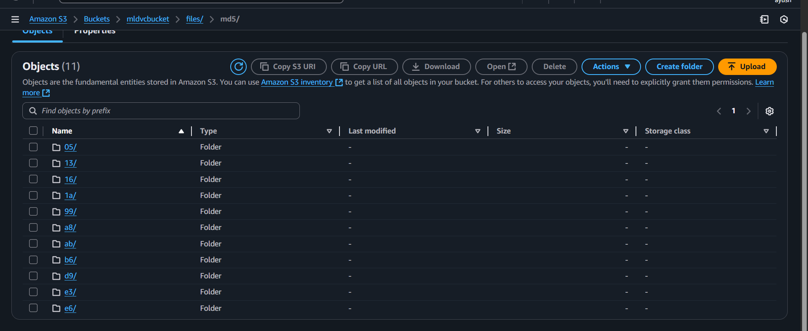

# End-to-End ML Pipeline using DVC and AWS S3



> This repository contains an end-to-end example ML pipeline that uses DVC to track data and models, and AWS S3 as remote storage. The pipeline ingests a spam dataset, preprocesses text, extracts TF-IDF features, trains a RandomForest model, and evaluates it. DVC stages orchestrate these steps so results are reproducible.

## Table of contents

- Project overview
- Repository structure
- Requirements
- Setup (Windows, PowerShell)
- How to run the pipeline (DVC)
- Individual script usage
- Configuration files
- DVC and S3 integration
- Troubleshooting & notes
- Files produced by the pipeline

## Project overview

This project demonstrates a typical ML workflow:

1. Data ingestion: download and split raw data.
2. Data preprocessing: text cleaning, label encoding, duplicate removal.
3. Feature engineering: TF-IDF vectorization.
4. Model building: train a RandomForest model.
5. Model evaluation: compute accuracy, precision, recall, AUC and record metrics with dvclive.

DVC is used to track large data/artifacts and the pipeline stages. Use `dvc repro` to reproduce the full pipeline and `dvc push` to push artifacts to remote storage (for example, an S3 bucket).

## Repository structure

Key files and directories:

- `params.yaml` — pipeline parameters (e.g., `feature_engineering.max_features`).
- `dvc.yaml` / `dvc.lock` — DVC pipeline and lock file.
- `data/` — DVC-tracked datasets and artifacts
  - `raw/`, `interim/`, `processed/`
- `models/` — DVC-tracked trained model (`model.pkl`)
- `reports/` — evaluation outputs (metrics)
- `src/` — Python scripts for each pipeline stage:
  - `src/data_ingestion.py`
  - `src/data_preprocessing.py`
  - `src/feature_engineering.py`
  - `src/model_building.py`
  - `src/model_evaluation.py`
- `experiments/` — notebook(s) and experiments
- `s3_bucket.png` — architecture/diagram image included above

## Requirements

Recommended: use the provided virtual environment `.venv`. The project requires Python 3.11+ (3.13 used here). Main Python packages used:

- numpy
- pandas
- scikit-learn
- nltk
- wordcloud
- dvclive
- dvc (cli installed in virtual environment)

You can install packages into the virtual environment using pip. Example:

```powershell
# Ensure venv exists and activate it (Windows PowerShell)
.\.venv\Scripts\Activate.ps1

# Install common packages (if not already installed)
python -m pip install -r requirements.txt
# or install specific packages
python -m pip install numpy pandas scikit-learn nltk wordcloud dvclive dvc
```

Note: On Windows, install native build tools if you need to build packages with C extensions (rare for this repo).

## Setup (PowerShell)

1. Activate venv (if you created it or the repository contains it):

```powershell
.\.venv\Scripts\Activate.ps1
```

2. (Optional) If the virtual environment is not present, create it and install dependencies:

```powershell
python -m venv .venv
.\.venv\Scripts\Activate.ps1
python -m pip install --upgrade pip
python -m pip install numpy pandas scikit-learn nltk wordcloud dvclive dvc pyyaml
```

3. Configure AWS CLI (if you plan to use an S3 remote):

```powershell
# If AWS CLI not installed system-wide, install via pip inside venv
python -m pip install awscli
# Then configure
aws configure
# Provide your AWS Access Key, Secret Key, default region and output format
```

4. Configure DVC remote to use your S3 bucket (example):

```powershell
# Example: add S3 remote (replace <bucket> and <prefix>)
.\.venv\Scripts\dvc.exe remote add -d s3remote s3://<bucket>/<prefix>
# Example with AWS profile and region (if needed):
.\.venv\Scripts\dvc.exe remote modify s3remote region us-east-1
```

If you prefer, run `dvc` after activating your venv so it uses the local dvc installation.

## How to run the full pipeline

From repo root (PowerShell, with venv activated):

```powershell
# Reproduce the full pipeline
dvc repro

# Optionally add generated changes to git
git add dvc.lock reports/.gitignore
git commit -m "Reproduce pipeline and add lock/report ignore"

# Push artifacts tracked by DVC to remote storage (S3)
dvc push
```

Notes:
- `dvc repro` runs only stages that changed.
- `dvc push` will transfer data files to the configured remote (e.g., S3). Ensure `aws configure` is done or the environment has proper credentials.

## Run individual steps

You can run each Python script directly (use venv python):

```powershell
# Data ingestion
python src/data_ingestion.py

# Data preprocessing
python src/data_preprocessing.py

# Feature engineering
python src/feature_engineering.py

# Model building
python src/model_building.py

# Model evaluation
python src/model_evaluation.py
```

Each script logs detailed debug info to `logs/`.

## params.yaml

This file contains pipeline hyperparameters, for example:

```yaml
feature_engineering:
  max_features: 3000
model_building:
  n_estimators: 22
  random_state: 2
```

Edit `params.yaml` to change TF-IDF vocabulary size or model hyperparameters and rerun `dvc repro`.

## DVC notes and best practices

- Keep large data, feature matrices and model binaries tracked by DVC, not Git.
- DVC produces `dvc.lock` — commit it for reproducibility.
- Use `dvc exp` if you want to run experiments and track results without committing to Git history.
- Configure remote storage (`dvc remote add`) before `dvc push`.

## Troubleshooting

- "ModuleNotFoundError": ensure you activated the project's venv and installed dependencies with `python -m pip install -r requirements.txt`.
- NLTK tokenizers: if you see errors about `punkt` or `stopwords`, run the NLTK downloads in Python:

```python
import nltk
nltk.download('punkt')
nltk.download('stopwords')
```

- If DVC complains a path is tracked by Git (e.g., `data/raw`), stop tracking it in Git and let DVC handle it:

```powershell
git rm -r --cached data\raw
git commit -m "stop tracking data/raw"
```

## Files produced by the pipeline

- `data/raw/*` — raw ingested files (DVC-tracked)
- `data/interim/*` — processed splits
- `data/processed/*` — TF-IDF feature CSVs
- `models/model.pkl` — trained model (DVC-tracked)
- `reports/metrics.json` — evaluation metrics
